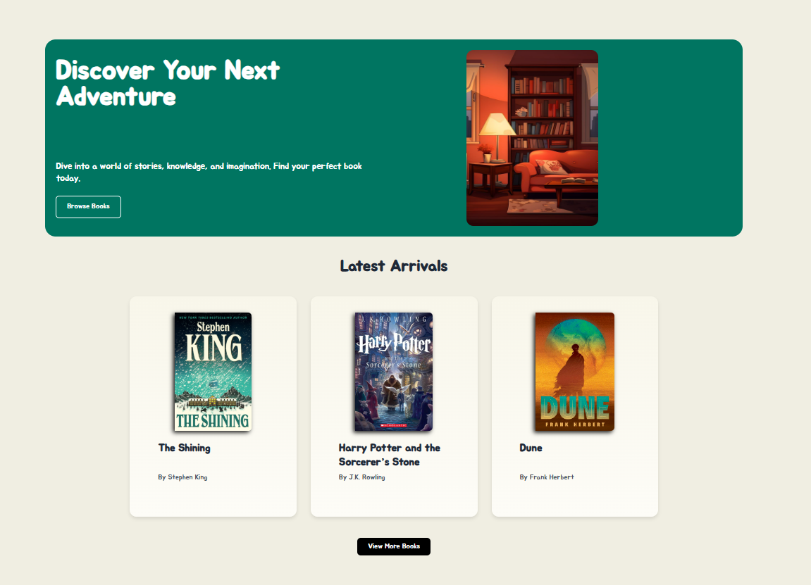
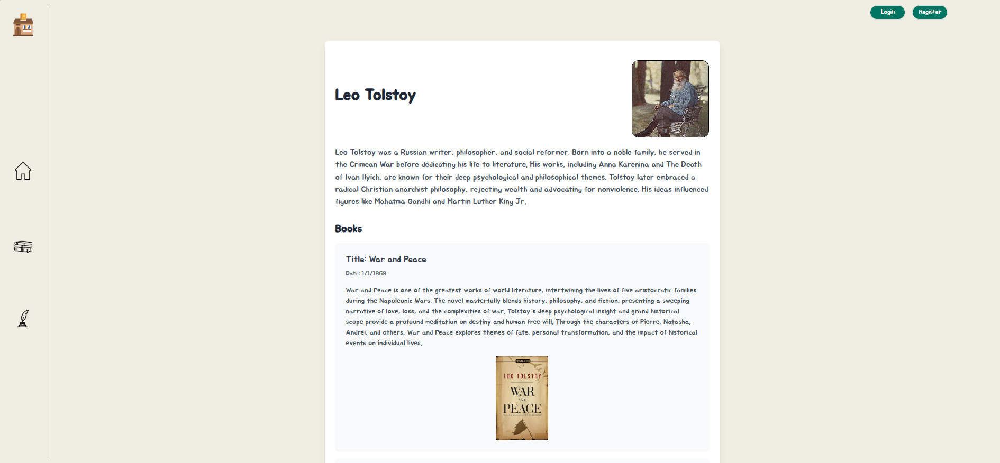
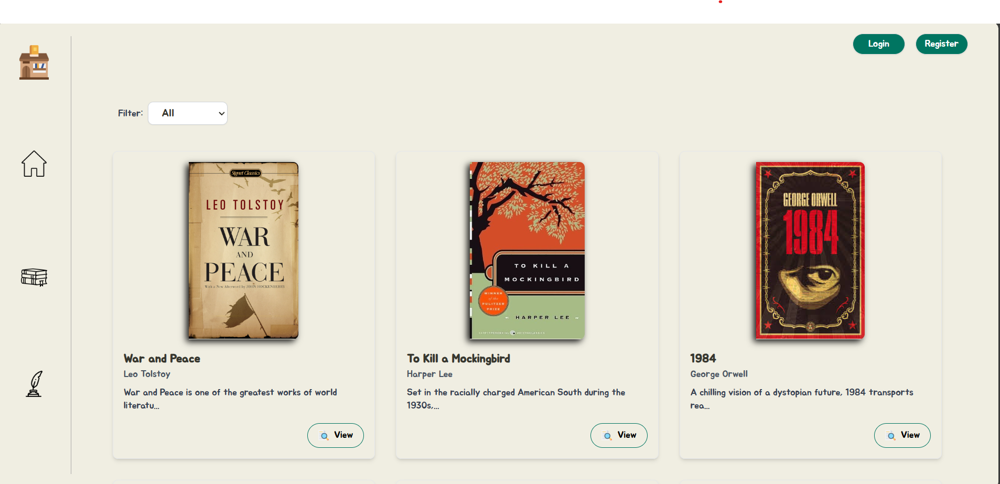
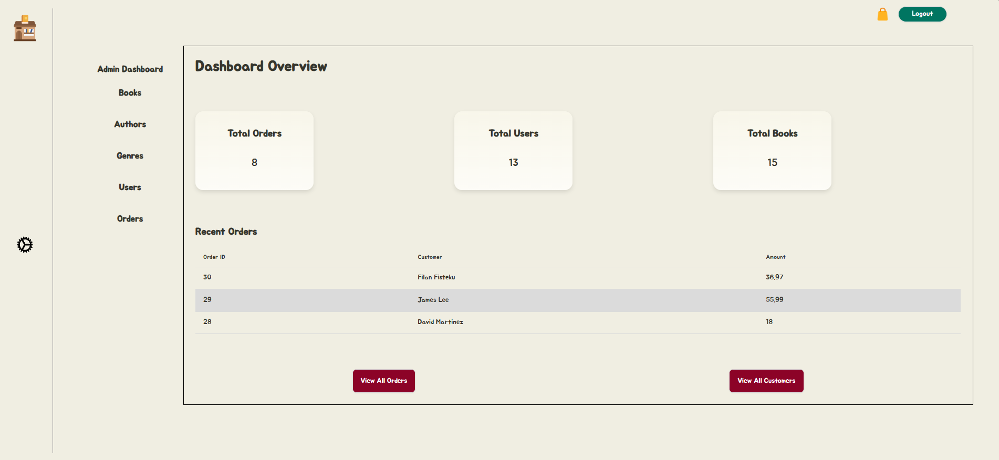
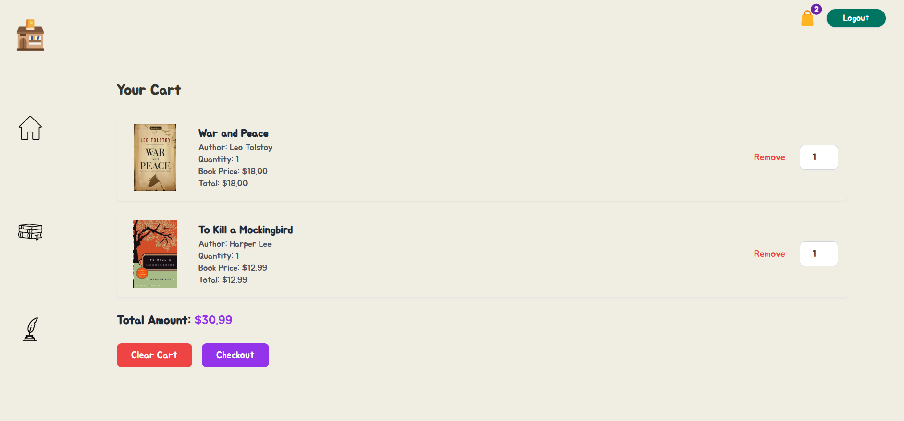

# 📚 Bookstore App

A full-stack Bookstore Management App where users can browse books, register/login, and admins can manage content. Built with **React + TypeScript** and **ASP.NET Core Web API** using **SQL Server** for data persistence — now with **Stripe payment integration**.

---


## ✨ Features

- 📖 Browse and filter book listings
- 🔍 Search by title or author
- 🧾 Register & login with JWT authentication
- 🛒 Add to cart and purchase books
- 💳 **Stripe Payments Integration**
- 🔐 Secure Admin Panel:
  - Add/Edit/Delete Books
  - Manage Authors & Categories
- 🔄 Full CRUD functionality
- ✅ Client-side and server-side validation

---

## 🛠️ Tech Stack

### Frontend
- ⚛️ React + TypeScript
- 🎨 Tailwind CSS + DaisyUI
- 🔁 Axios for API communication
- 🔒 JWT decoding and auth flow
- 🧭 React Router DOM

### Backend
- 🚀 ASP.NET Core Web API
- 🗄️ Entity Framework Core (EF)
- 🧾 SQL Server
- 💳 Stripe .NET SDK

---

## 🖼️ Screenshots

### 🏠 Homepage


### Author Page


### Book Page


### 🛠️ Admin Panel


### Cart



---

## ⚙️ Getting Started

### 🖥️ Frontend

```bash
cd client
yarn install
yarn dev

